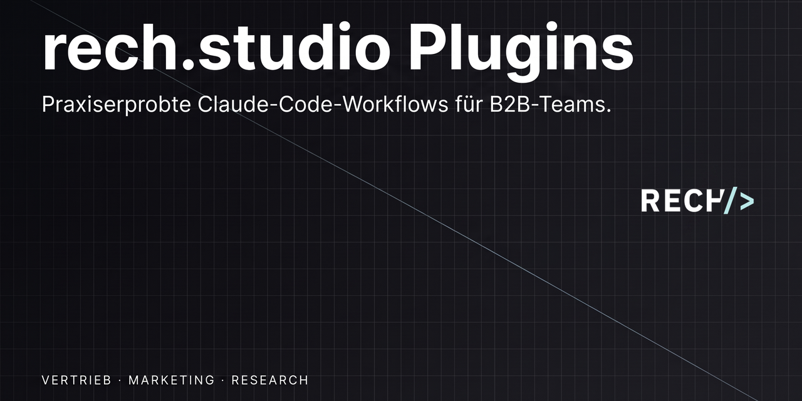

<p align="center">
  <a href="https://rech.studio">
    
  </a>
</p>

<p align="center">
  <a href="#installation"></a>
  <a href="#verfügbare-plugins"></a>
  <a href="LICENSE"></a>
  <a href="https://rech.studio"></a>
</p>

# rech.studio Plugins für Claude Code

> **Plugin-Marketplace von [rech.studio](https://rech.studio) für [Claude Code](https://docs.claude.com/claude-code).**
> KI-gestützte Workflows für B2B-Teams — Vertrieb, Marketing, Research.

Dieses Repository ist **kein Plugin selbst**, sondern der Katalog. Die eigentlichen Plugins liegen in eigenen Repos und werden hier nur referenziert.

## Verfügbare Plugins

| Plugin | Beschreibung | Plugin-Repo |
|---|---|---|
| `ki-vertriebsteam` | Skills und Agents für einen KI-gestützten B2B-Vertriebs-Workflow — Prospecting, Qualifizierung, Outreach, Proposals, Follow-up. | [jonasrech/ki-vertriebsteam-claude](https://github.com/jonasrech/ki-vertriebsteam-claude) |

## Installation

Du brauchst eine aktuelle Version von [Claude Code](https://docs.claude.com/claude-code) — als **CLI**, **Desktop-App** (macOS/Windows), **VS Code Extension** oder **JetBrains Plugin**.

### CLI / VS Code / JetBrains

**1. Marketplace hinzufügen** (einmalig):

```bash
/plugin marketplace add jonasrech/rech-studio-plugins
```

**2. Plugin installieren:**

```bash
/plugin install ki-vertriebsteam@rech-studio
```

### Claude Code Desktop-App (Code-Tab)

Im Desktop-App läuft Plugin-Management über die **UI**, nicht über Slash-Commands ([offizielle Doku](https://docs.claude.com/en/docs/claude-code/desktop#install-plugins)):

1. **Lokale Session** im **Code**-Tab starten (Plugins sind in Remote-Sessions nicht verfügbar).
2. Auf den **`+` Button** neben der Prompt-Eingabe klicken → **Plugins** → **Add plugin**.
3. Im Plugin-Browser den Marketplace `jonasrech/rech-studio-plugins` hinzufügen und anschließend `ki-vertriebsteam` installieren.
4. Über **Manage plugins** lassen sich Plugins später aktivieren, deaktivieren oder deinstallieren.

> Alternativ: Auf jeder Oberfläche kannst du den Marketplace auch projektweit über `.claude/settings.json` festlegen — siehe Abschnitt [Team-Marketplaces in der offiziellen Doku](https://docs.claude.com/en/docs/claude-code/discover-plugins#configure-team-marketplaces).

Danach stehen die Skills als Slash-Commands zur Verfügung, z. B. `/ki-vertriebsteam:sales-prep` oder `/ki-vertriebsteam:sales-objections`.

## Updates

Wenn ein Plugin aktualisiert wird, hol dir die neue Version mit:

```bash
/plugin marketplace update rech-studio
/plugin update ki-vertriebsteam
```

## Plugin entfernen

```bash
/plugin uninstall ki-vertriebsteam
```

Den kompletten Marketplace entfernen:

```bash
/plugin marketplace remove rech-studio
```

## Wie ist das hier aufgebaut?

```
rech-studio-plugins/
├── .claude-plugin/
│   └── marketplace.json   ← Katalog: listet alle rech.studio-Plugins
├── README.md
└── LICENSE
```

Die `marketplace.json` ist ein reines Verzeichnis. Jeder Eintrag verweist auf ein eigenes Plugin-Repository — die Plugins selbst werden dort gepflegt und versioniert, nicht hier.

## Für Entwickler:innen — wie kommt ein neues Plugin in den Marketplace?

1. Plugin-Repo auf GitHub anlegen (z. B. `jonasrech/rech-studio-marketing`) mit `.claude-plugin/plugin.json` + Skills/Agents/Hooks. Mit `git tag v0.1.0` taggen.
2. Eintrag in [`.claude-plugin/marketplace.json`](./.claude-plugin/marketplace.json) ergänzen:
   ```json
   {
     "name": "rech-studio-marketing",
     "source": {
       "source": "github",
       "repo": "jonasrech/rech-studio-marketing",
       "ref": "v0.1.0"
     },
     "description": "...",
     "category": "productivity",
     "license": "MIT",
     "homepage": "https://rech.studio",
     "strict": true
   }
   ```
3. Commit, push.
4. Bestehende Nutzer:innen sehen das neue Plugin nach `/plugin marketplace update rech-studio`.

Bei jedem neuen Plugin-Release das `ref` in der `marketplace.json` auf den neuen Tag bumpen, damit Updates ausgerollt werden.

## Hinweis zur aktuellen Version

Der `ref` ist im aktuellen `ki-vertriebsteam`-Eintrag bewusst nicht gesetzt — der Marketplace verfolgt zunächst den `main`-Branch des Plugin-Repos. Sobald das Plugin-Repo seinen ersten stabilen Release-Tag (`v0.1.0`) hat, wird der Eintrag um `"ref": "v0.1.0"` ergänzt, damit Updates kontrolliert ausgerollt werden.

## Lizenz

[MIT](./LICENSE) — Copyright (c) 2026 Jonas Rech / rech.studio ([https://www.rech.studio](https://www.rech.studio))

---

<p align="center">
  Built by <a href="https://rech.studio">rech.studio</a> for B2B teams who deserve better tooling.
</p>
